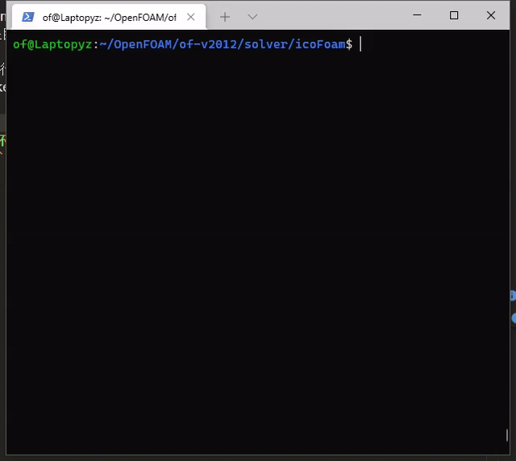

# of_cmake_config
[中文](./README.zh_CN.md) | [English](./README.md)

#### Introduction
This project is used to generate `CMakeLists.txt` for OpenFOAM projects.

#### Installation Guide
0. Activate the required OpenFOAM environment (otherwise the installation will fail).
1. Obtain the project source code: `git clone https://github.com/zhyang-dev/of_cmake_config.git`
2. Install: `cd of_cmake_config && ./install`

#### Usage Instructions

0. Activate the OpenFOAM environment.
1. In the project's root directory:
    - Run `ofCmakeConfig` to generate `CMakeLists.txt`.
    - Or run `occ`, which will execute `ofCmakeConfig` and call `cmake -B build`, eventually generating `compile_commands.json` in the build directory.

#### Testing Environment
- `vscode` + `clangd`
- `vim` + `coc-clangd`

The following demonstrates the second scenario based on the icoFoam case.  
