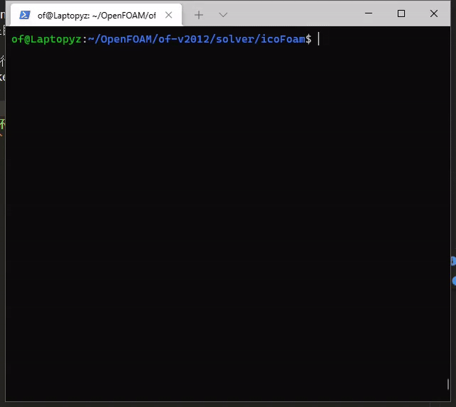

# of_cmake_config
[中文](./README.zh_CN.md) | [English](./README.md)

#### 介绍
本项目用于生成OpenFOAM项目的CMakeLists.txt

#### 安装教程
0. 激活需要的OpenFOAM环境（否则会安装失败）
1. 获取该项目源码：`git clone https://github.com/zhyang-dev/of_cmake_config.git`
2. 安装：`cd of_cmake_config && ./install`

#### 使用说明

0. 激活OpenFOAM环境
1. 在项目根目录下, 
    - 运行 `ofCmakeConfig`，可以生成`CMakeLists.txt`
    - 或运行`occ`，它会执行`ofCmakeConfig`，并调用`cmake -B build`，最终在build中会生成`compile_commands.json`。

#### 测试环境
- `vscode` + `clangd`
- `vim` + `coc-clangd`

以下基于icoFoam算例，演示第二种情况。  

